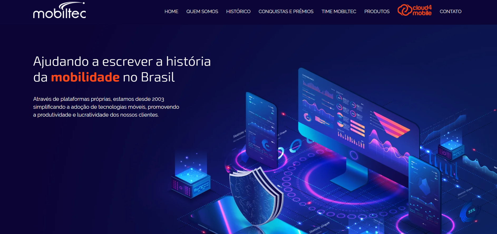

<!-- TITLE -->
<h1 align="center" color="black"><a href="https://www.mobiltec.com.br/" target="_blank">Mobiltec</a></h1>

<!-- THUMB -->

  

<!-- STATUS -->

---

<!-- DESCRIPTION -->

 
        💡 
        Este projeto é uma base para estudar front-end com ênfase em responsividade, PHP e Sass, buscando melhorar habilidades e adotar práticas eficientes de desenvolvimento web.
    

<!-- INTRO -->

## Índice

- [Tecnologias](#tecnologies)
- [Objetivo](#goal)
- [Autor](#authors)

## Tecnologias 

- PHP
- JavaScript
- Sass
- AOS (Animações)

## Objetivo 

Aprimorar habilidades no Front-end com foco em responsividade, PHP e Sass.

## Autor 

- [@Gabriel Assunção](https://github.com/zDeep10) - Ideia e Construção
